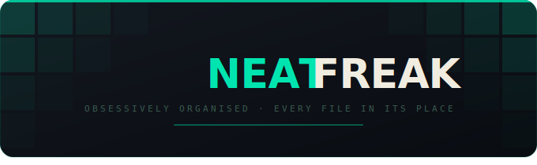
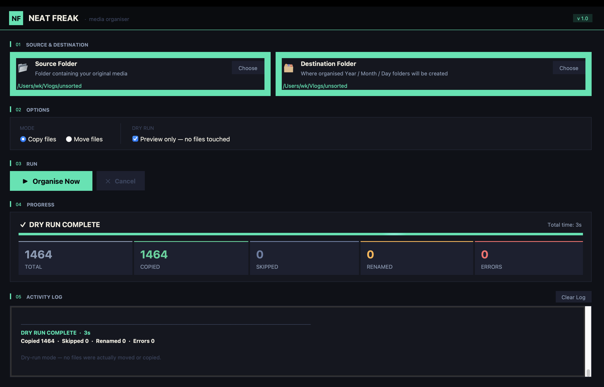

<div align="center">

<!-- HERO BANNER — rendered as inline SVG by GitHub -->
<div align="center">
  
</div>

<br/>

<!-- Badges -->
<p>
  
  
  
  
  
</p>

<p>
A macOS desktop app that <strong>automatically sorts your photos & videos</strong><br/>
into tidy <code>Year → Month → Day</code> folders based on when they were actually filmed.
</p>

<br/>

<!-- Quick install strip -->
```bash
brew install python-tk && python3 NeatFreak.py
```

<br/>

<!-- Replace screenshot.png with your actual screenshot file -->


<br/>
</div>

---

## 〇  The Story

> This started as a rough 15-line script in **2018** — born out of frustration with hundreds of vlog files scattered across hard drives with no rhyme or reason. The script did one thing: move files into dated folders. It was ugly, hardcoded, and it worked.
>
> Fast forward to 2026. The same problem, but bigger libraries, better taste, and the skills to do it properly. **Neat Freak** is the full rebuild — a real macOS app, designed with intention.

---

## ◈  What It Does

Neat Freak scans a folder (and all sub-folders), reads the **actual capture date** from photo EXIF data and video metadata, then organises everything into a clean hierarchy:

```
📁 Destination/
 └── 2024/
      ├── 8-August/
      │    ├── 14/
      │    │    ├── IMG_1234.jpg
      │    │    └── VID_0056.mp4
      │    └── 28/
      │         └── DSC_0891.heic
      └── 9-September/
           └── 3/
                └── DSCF4462.MP4
```

---

## ◈  Features

<table>
<tr>
<td width="50%">

**🎯 Smart Date Reading**
Reads EXIF `DateTimeOriginal` from photos and creation metadata from videos. Falls back to file modification date if metadata is missing.

</td>
<td width="50%">

**🛡️ Safe by Default**
Copies files — never moves unless you ask. Skips files already at the destination if name and size match.

</td>
</tr>
<tr>
<td width="50%">

**♻️ Duplicate Handling**
Same filename but different content? Neat Freak renames the incoming file (`IMG_001_1.jpg`) instead of silently overwriting.

</td>
<td width="50%">

**👁️ Dry Run Mode**
Preview exactly what would happen — every copy, skip, and rename — before a single file is touched.

</td>
</tr>
<tr>
<td width="50%">

**📊 Live Progress**
Animated progress bar with real-time ETA, per-file activity log, and a colour-coded summary at the end.

</td>
<td width="50%">

**📦 Zero Lock-in**
Plain Python + Tkinter. No cloud, no subscriptions, no accounts. Your files stay yours.

</td>
</tr>
</table>

---

## ◈  Supported Formats

| Photos | Videos |
|--------|--------|
| `.jpg` `.jpeg` `.png` `.heic` `.heif` | `.mp4` `.mov` `.avi` `.mkv` `.m4v` |
| `.tiff` `.bmp` `.webp` `.dng` | `.3gp` `.wmv` `.flv` `.mts` `.m2ts` |
| `.raw` `.cr2` `.nef` `.arw` | |

---

## ◈  Installation

### Requirements

```bash
# Required — Python with modern Tkinter
brew install python-tk

# Optional — significantly better date extraction
pip3 install pillow hachoir
```

### Option A — Double-click launcher *(easiest)*

```bash
# One-time setup
chmod +x NeatFreak.command
```

Then just **double-click** `NeatFreak.command` any time. No Terminal needed.

### Option B — Build a proper `.app` bundle

```bash
# Install build tool
python3 -m venv build_env
source build_env/bin/activate
pip install py2app

# Build
python3 setup.py py2app

# Install
cp -r dist/NeatFreak.app /Applications/
```

Neat Freak will appear in Launchpad and Spotlight like any native Mac app.

### Option C — Run directly

```bash
python3 NeatFreak.py
```

---

## ◈  How Date Priority Works

```
1st  EXIF DateTimeOriginal   ← actual shutter press (photos)
2nd  Video creation metadata ← camera-recorded timestamp (videos)
3rd  File modification time  ← fallback when metadata is absent
```

Install `pillow` and `hachoir` to unlock levels 1 and 2.

---

## ◈  Duplicate Logic

| Scenario | Action |
|---|---|
| File doesn't exist at destination | ✅ Copy / Move normally |
| Same filename **and** same file size | ⏭️ Skip — already there |
| Same filename but **different** size | 📋 Copy with suffix `_1`, `_2`… |
| Destination folder already exists | ✅ Reuse — never recreated |

---

## ◈  Project Structure

```
NeatFreak/
├── NeatFreak.py          ← main application
├── NeatFreak.command     ← double-click launcher
├── setup.py              ← py2app build config
├── make_icon.py          ← generates app icon
└── README.md
```

---

## ◈  Roadmap

- [ ] Drag-and-drop folder selection
- [ ] HEIC thumbnail preview in log
- [ ] Undo last run
- [ ] App Store release
- [ ] Windows / Linux port

---

## ◈  License

MIT — do whatever you want with it don't forget to give me credit though :)

---

<div align="center">

<br/>

<svg width="100%" height="36" viewBox="0 0 680 36" xmlns="http://www.w3.org/2000/svg">
  <rect width="680" height="36" rx="8" fill="#0a0c10"/>
  <rect x="0" y="0" width="4" height="36" rx="2" fill="#00e5b0"/>
  <text x="18" y="23" font-family="monospace" font-size="12" fill="#64748b">made with obsession · every file in its place</text>
</svg>

<br/><br/>

<sub>Built by <a href="https://github.com/YOUR_USERNAME">Wadhha</a> · Started 2018 · Rebuilt 2026</sub>

</div>